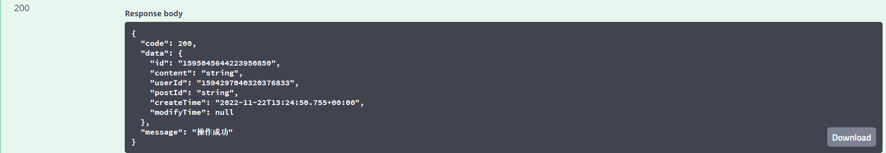

bms-comment-controller/comment/create-api
#### 接口简介
&emsp;&emsp;创建评论

#### 基本信息：
+ 接口状态：已完成
+ 接口地址：http://localhost:8000/comment/create
+ 请求方式：POST
+ 请求类型：
#### 请求参数：
|  字段   | 说明 | 类型 | 备注 | 是否必填 |
|  ----   | ----  | ---- | ---- | ---- |
| dto  | body | Object|  | 是 |
| userName  | 创建者用户名 | String |  | 是 |

#### dto
|字段|说明|类型|备注|是否必填|
|-|-|-|-|-|
|content|评论内容|String||是|
|postId|评论id|String||是|

#### 相应参数：
|  字段   | 说明 | 类型 | 备注 | 
|  ----   | ----  | ---- | ---- |
| code  | 接口状态码 | Number | 成功：200 | 
| message  | 接口信息 | String |  |
| data | 返回数据 |Object| |

#### data
|  字段   | 说明 | 类型 | 备注 | 
|  ----   | ----  | ---- | ---- |
| id  | 贴子id | String |  | 
| content  | 评论内容 | String |  |
| userId | 评论用户id|String ||
|postId| 评论id|String||
|createTime|创建评论时间|String||
|modifyTime|修改评论时间|String|未修改为：null|

#### 响应实例：

