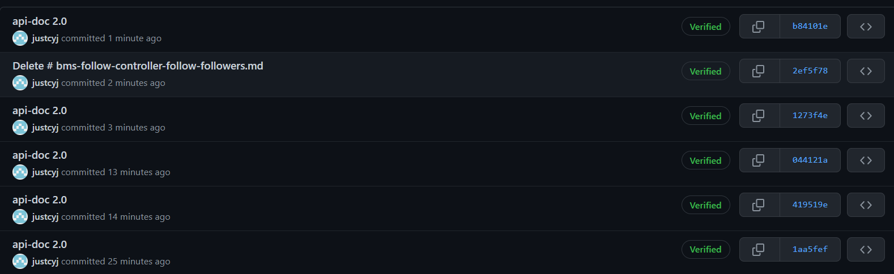
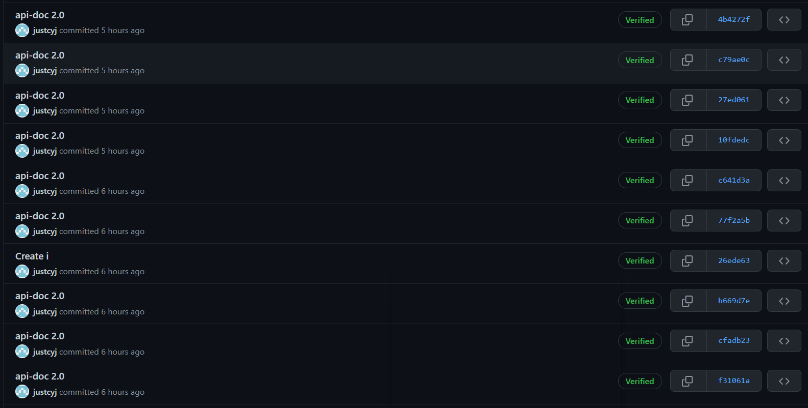
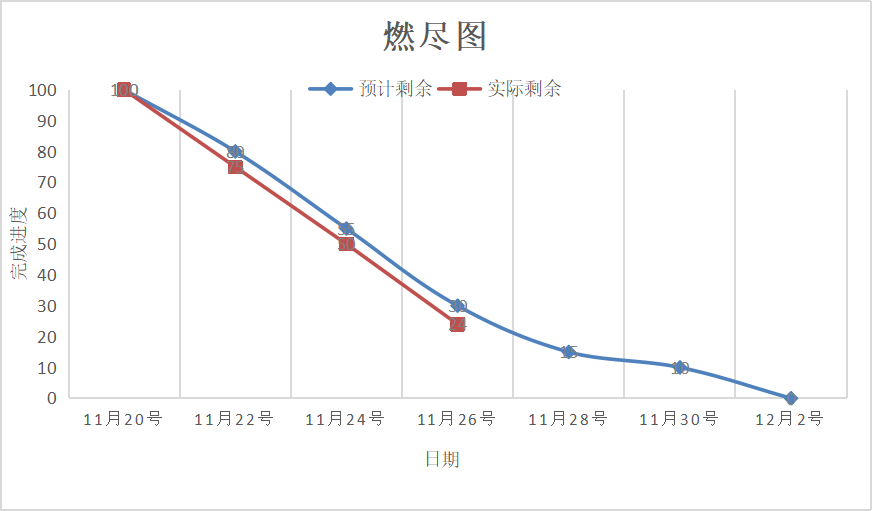

- **姓名：蔡勇捷**

> - **过去两天完成了哪些任务**
>
>   - **文字描述**
>
>     继续进行接口测试，完成接口文档编写
> - **展示GitHub当日代码/文档签入记录**
>
> 
> 
>
>
> - **接下来的计划**
>
>   - 对剩余的接口继续进行调试和编写文档
>   - 协助队友完成功能实现及测试任务
>
>
> - **还剩下哪些任务**
>
>   - 接口文档编写
>
> - **燃尽图**
>
>   
>
> - **遇到哪些困难**
>
>   - 接口参数类型较多，以及接口存在bug问题
>
> - **有哪些收获和疑问**
>
>   - 更加熟练了接口测试和文档的编写
>
> - **PSP & 学习进度条**
>
>   | PSP2.1                                  | Personal Software Process Stages          | 预估耗时（分钟） | 实际耗时（分钟） |
>   | :-------------------------------------- | :---------------------------------------- | :--------------- | :--------------- |
>   | Planning                                | 计划                                      | 6                | 15               |
>   | · Estimate                              | · 估计这个任务需要多少时间                | 5                | 5                |
>   | Development                             | 开发                                      | 100              | 100              |
>   | · Analysis                              | · 需求分析 (包括学习新技术)               | 120              | 60               |
>   | · Design Spec                           | · 生成设计文档                            | 0                | 0                |
>   | · Design Review                         | · 设计复审                                | 5                | 5                |
>   | · Coding Standard                       | · 代码规范 (为目前的开发制定合适的规范)   | 5                | 5                |
>   | · Design                                | · 具体设计                                | 35               | 50               |
>   | · Coding                                | · 具体编码                                | 0                | 0                |
>   | · Code Review                           | · 代码复审                                | 5                | 5                |
>   | · Test                                  | · 测试（自我测试，修改代码，提交修改）120 | 120              | 100              |
>   | Reporting                               | 报告                                      | 0                | 0                |
>   | · Test Report                           | · 测试报告                                | 100              | 80               |
>   | · Size Measurement                      | · 计算工作量                              | 5                | 10               |
>   | · Postmortem & Process Improvement Plan | · 事后总结, 并提出过程改进计划            | 10               | 10               |
>   |                                         | · 合计                                    | 516              | 445              |
>
>   | 第N轮 | 新增代码（行） | 累计代码（行） | 本轮学习耗时（小时） | 累计学习耗时（小时） | 重要成长               |
>   | :---- | :------------- | :------------- | :------------------- | :------------------- | :--------------------- |
>   | 1     | 210            | 210            | 9                    | 9                    | 掌握接口测试           |
>   | 2     | 180            | 390            | 8                    | 17                   | 熟练接口测试           |
>   | 3     | 220            | 610            | 8.5                  | 25.5                 | 熟练接口测试和文档编写 |
