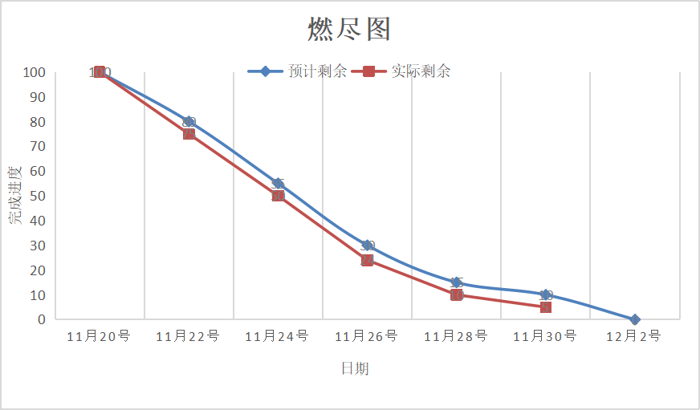

- **姓名：蔡勇捷**

> - **过去两天完成了哪些任务**
>
>   - **文字描述**
>
> 
>       协助队友完成测试
>
>       协助队友完成界面的bug
>     
>
> - **接下来的计划**
>
>   - 协助队友完成功能实现及测试任务
>   - 后端bug修复
>
> - **还剩下哪些任务**
>
>   - 继续完善后端
>
> - **燃尽图**
> 
> 
>
> - **遇到哪些困难**
>
>   - 无
>
> - **有哪些收获和疑问**
>
>   - 测试接口和修复bug的能力upup
>
> - **PSP & 学习进度条**
>
>   | PSP2.1                                  | Personal Software Process Stages        | 预估耗时（分钟） | 实际耗时（分钟） |
>   | :-------------------------------------- | :------------------ | :--------------- | :------|
>   | Planning           | 计划           | 6                | 15       |
>   | · Estimate     | · 估计这个任务需要多少时间     | 5    | 5       |
>   | Development                             | 开发                                    | 60              | 60              |
>   | · Analysis                              | · 需求分析 (包括学习新技术)             | 60               | 30               |
>   | · Design Spec                           | · 生成设计文档                          | 0                | 0                |
>   | · Design Review                         | · 设计复审                              | 5                | 5               |
>   | · Coding Standard                       | · 代码规范 (为目前的开发制定合适的规范) | 5                | 5                |
>   | · Design                                | · 具体设计                              | 35               | 50               |
>   | · Coding                                | · 具体编码                              | 60              | 80              |
>   | · Code Review                           | · 代码复审                              | 5                | 5                |
>   | · Test                                  | · 测试（自我测试，修改代码，提交修改）  | 10                | 15               |
>   | Reporting                               | 报告                                    | 0                | 0                |
>   | · Test Report                           | · 测试报告                              | 0                | 0                |
>   | · Size Measurement                      | · 计算工作量                            | 5                | 10               |
>   | · Postmortem & Process Improvement Plan | · 事后总结, 并提出过程改进计划          | 10               | 10               |
>   |                                         | · 合计                                  |   266           |              290 |
>
> 
