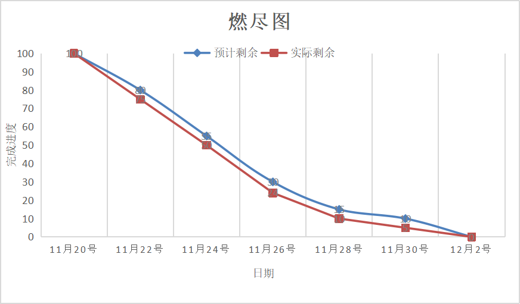

- **姓名：胡浩伟**

> - **过去两天完成了哪些任务**
>
>   - **文字描述**
>
>     接口测试已经全部完成
>
> - **展示GitHub当日代码/文档签入记录**
>
>   - 无
>
>
> - **接下来的计划**
>
>   - 无
>
> - **还剩下哪些任务**
>
>   - 无
>
> - **燃尽图**
>
>   
>
> - **遇到哪些困难**
>
>   - 准备好好复习考试
>
> - **有哪些收获和疑问**
>
>   - 这次软件工程实践给我带来了许多的收获，首先是编写代码能力的提升，紧接着是接口测试能力的提升，这次的实践让我真正体会到了团队合作的魅力，令我受益匪浅，这次的收获将令我受益终身，最后感谢队友成功带飞我，我躺的明明白白。
>
> - **PSP & 学习进度条**
>
>   | PSP2.1                                  | Personal Software Process Stages        | 预估耗时（分钟） | 实际耗时（分钟） |
>   | :-------------------------------------- | :-------------------------------------- | :--------------- | :--------------- |
>   | Planning                                | 计划                                    | 0                | 0                |
>   | · Estimate                              | · 估计这个任务需要多少时间              | 0                | 0                |
>   | Development                             | 开发                                    | 0                | 0                |
>   | · Analysis                              | · 需求分析 (包括学习新技术)             | 0                | 0                |
>   | · Design Spec                           | · 生成设计文档                          | 0                | 0                |
>   | · Design Review                         | · 设计复审                              | 0                | 0                |
>   | · Coding Standard                       | · 代码规范 (为目前的开发制定合适的规范) | 0                | 0                |
>   | · Design                                | · 具体设计                              | 0                | 0                |
>   | · Coding                                | · 具体编码                              | 0                | 0                |
>   | · Code Review                           | · 代码复审                              | 0                | 0                |
>   | · Test                                  | · 测试（自我测试，修改代码，提交修改）  | 10               | 20               |
>   | Reporting                               | 报告                                    | 0                | 0                |
>   | · Test Report                           | · 测试报告                              | 10               | 15               |
>   | · Size Measurement                      | · 计算工作量                            | 5                | 10               |
>   | · Postmortem & Process Improvement Plan | · 事后总结, 并提出过程改进计划          | 20               | 30               |
>   |                                         | · 合计                                  | 45               | 75               |
>
>   | 第N轮 | 新增代码（行） | 累计代码（行） | 本轮学习耗时（小时） | 累计学习耗时（小时） | 重要成长               |
>   | :---- | :------------- | :------------- | :------------------- | :------------------- | :--------------------- |
>   | 1     | 210            | 210            | 9                    | 9                    | 掌握接口测试           |
>   | 2     | 180            | 390            | 8                    | 17                   | 熟练接口测试           |
>   | 3     | 220            | 610            | 8.5                  | 25.5                 | 熟练接口测试和文档编写 |
>   | 4     | 60             | 670            | 4                    | 29.5                 | 熟练接口测试和文档编写 |
>   | 5     | 50             | 720            | 3                    | 32.5                 | 熟练接口测试和文档编写 |
>   | 6     | 30             | 750            | 1                    | 33.5                 | 队友好强               |