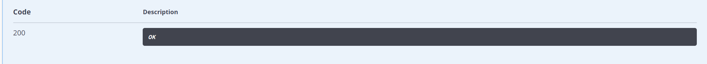

# bms-comment-controller/comment/commentLists-api
#### 接口简介
&emsp;&emsp;根据贴子的id获取评论

#### 基本信息：
+ 接口状态：已完成
+ 接口地址：http://localhost:8000/comment/commentLists
+ 请求方式：GET
+ 请求类型：
#### 请求参数：
|  字段   | 说明 | 类型 | 备注 | 是否必填 |
|  ----   | ----  | ---- | ---- | ---- |
| postid  | 贴子创建时自动生成的贴子id | String | 存在该贴子id返回评论 否则返回空 | 是 |

#### 相应参数：
|  字段   | 说明 | 类型 | 备注 | 
|  ----   | ----  | ---- | ---- | 
| code  | 接口状态码 | Number | 成功：200 | 
| message  | 接口信息 | String | 成功：操作成功 | 
|data|返回数据|Object|无|

##### data
|字段 |说明 |类型 |备注|
|---|---|---|---|
|content|评论内容|String|无|
|createTime|创建评论的日期|String|无|
|id|评论的id|String|无|
|postid|贴子的id|String|无|
|userid|用户id|String|无|
|username|用户名|String|无|

#### 响应实例：

