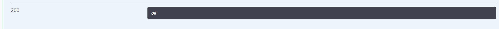

# bms-follow-controller/follow/followers/{id}-api
#### 接口简介
&emsp;&emsp;查看关注

#### 基本信息：
+ 接口状态：已完成
+ 接口地址：http://localhost:44444/follow/followers
+ 请求方式：GET
+ 请求类型：
#### 请求参数：
|  字段   | 说明 | 类型 | 备注 | 是否必填 |
|  ----   | ----  | ---- | ---- | ---- |
| id  | 用户id | String |  | 是 |
| username  | 用户名 | String |  | 是 |

#### 相应参数：
|  字段   | 说明 | 类型 | 备注 |
|  ----   | ----  | ---- | ---- |
| code  | 接口状态码 | Number | 成功：200 | 
| message  | 接口信息 | String |  |
|data|返回数据|Object||

#### data
|字段|说明|类型|备注|
|-|-|-|-|
|alias|昵称|String||
|avatar|头像|String||
|dep|专业|String||
|id|我的id|String||
|isMyFollowed|判断是不是有关注我|Bool||
|sign|是否是是粉丝标志|String||
|username|用户名|String||

#### 响应实例：

