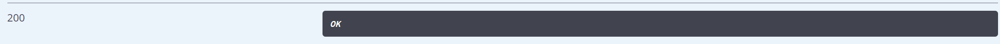

# 4.bms-follow-controller/follow/subscribe/{userId}-api
#### 接口简介
&emsp;&emsp;关注操作

#### 基本信息：
+ 接口状态：已完成
+ 接口地址：http://localhost:8000/follow/subscribe
+ 请求方式：GET
+ 请求类型：
#### 请求参数：
|  字段   | 说明 | 类型 | 备注 | 是否必填 |
|  ----   | ----  | ---- | ---- | ---- |
| userid  | 关注对象的id | String | 无 | 是 |
| username  | 我的用户名 | String | 无 | 是 |

#### 相应参数：
|  字段   | 说明 | 类型 | 备注 |
|  ----   | ----  | ---- | ---- | 
| code  | 接口状态码 | Number | 成功：200 |
| message  | 接口信息 | String | 无 |
|data|返回数据|Object|成功：OK|

#### 响应实例：

