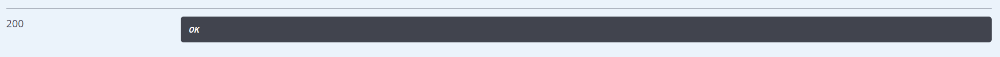

# bms-tag-controller/tag-api
#### 接口简介
&emsp;&emsp;通过标签检索贴子

#### 基本信息：
+ 接口状态：已完成
+ 接口地址：http://localhost:44444/tag
+ 请求方式：GET
+ 请求类型：
#### 请求参数：
|  字段   | 说明 | 类型 | 备注 | 是否必填 |
|  ----   | ----  | ---- | ---- | ---- |
| name  | 标签名 | String |  | 是 |

#### 相应参数：
|  字段   | 说明 | 类型 | 备注 |
|  ----   | ----  | ---- | ---- | 
| code  | 接口状态码 | Number |  | 
| message  | 接口信息 | String |  | 
|data|返回数据|Object||

#### 响应实例：

