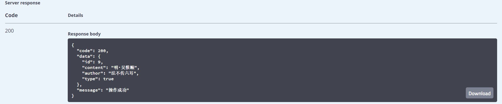

# 1.bms-tip-controller/tip/daily-api
#### 接口简介
&emsp;&emsp;获取名言

#### 基本信息：
+ 接口状态：已完成
+ 接口地址：http://localhost:8000/tip/daily
+ 请求方式：GET
+ 请求类型：
#### 请求参数：
&ensp;&ensp;无

#### 相应参数：
|  字段   | 说明 | 类型 | 备注 | 
|  ----   | ----  | ---- | ---- | 
| code  | 接口状态码 | NUmber | 成功：200 | 
| message  | 接口信息 | String | 成功：操作成功 |
|data|返回数据|Object||

##### data
|字段|说明|类型|备注|
|-|-|-|-|
|id|界面展示名言的id|Number||
|content|界面展示名言|String||
|author|界面展示名言的作者|String||
|type|***|Bool||

#### 响应实例：

