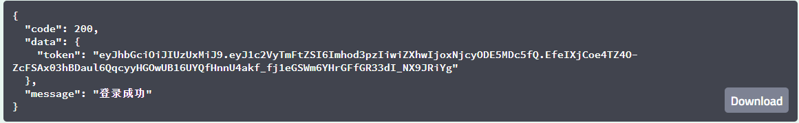

#                        bms-user-controller/login

#### 接口简介

  用户进行登录的接口

#### 基本信息：

- 接口状态：已完成
- 接口地址：http://localhost:8000/user/login
- 请求方式：POST
- 请求类型：

#### 请求参数：

| 字段       | 说明         | 类型   | 备注                       | 是否必填 |
| ---------- | ------------ | ------ | -------------------------- | -------- |
| name       | 注册姓名     | String | 姓名不能与已存在的姓名一致 | 是       |
| pass       | 注册密码     | String | 必须与checkpass一致        | 是       |
| rememberMe | 是否记住name | Number | 1：是，0：否               | 是       |

#### 返回参数：

| 字段    | 说明       | 类型   | 备注                                       |
| ------- | ---------- | ------ | ------------------------------------------ |
| code    | 接口状态码 | Number | 成功：200  失败：-1                        |
| message | 接口信息   | String | 成功：操作成功   失败：用户名或密码错误 |
| data    | 返回数据   | Object | 是                                         |

data：

| 字段  | 说明  | 类型   | 备注 |
| ----- | ----- | ------ | ---- |
| token | token | String |      |

#### 响应实例：

