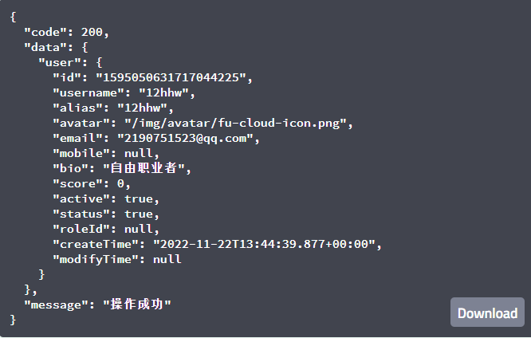

# bms-user-controller/register

#### 接口简介

  用户进行注册的接口

#### 基本信息：

- 接口状态：已完成
- 接口地址：http://localhost:8000/user/register
- 请求方式：POST
- 请求类型：

#### 请求参数：

| 字段      | 说明         | 类型   | 备注                       | 是否必填 |
| --------- | ------------ | ------ | -------------------------- | -------- |
| name      | 注册姓名     | String | 姓名不能与已存在的姓名一致 | 是       |
| pass      | 注册密码     | String | 必须与checkpass一致        | 是       |
| checkpass | 确认注册密码 | String | 必须与pass一致             | 是       |
| email     | 注册邮箱     | String | 不能与已注册的邮箱一致     | 是       |

#### 返回参数：

| 字段    | 说明       | 类型   | 备注                                                 |
| ------- | ---------- | ------ | ---------------------------------------------------- |
| code    | 接口状态码 | Number | 成功：200  失败：-1                                  |
| message | 接口信息   | String | 成功：操作成功   失败：用户名已存在或邮箱已被注册 |
| data    | 返回数据   | Object | 是                                                   |

data：

| 字段 | 说明       | 类型   | 备注 |
| ---- | ---------- | ------ | ---- |
| user | 注册人信息 | Object |      |

user：

| 字段       | 说明     | 类型   | 是否非空 | 备注               |
| ---------- | -------- | ------ | -------- | ------------------ |
| id         | 用户id   | String | 是       |                    |
| username   | 用户名   | String | 是       |                    |
| alias      | 用户昵称 | String | 否       |                    |
| avatar     | 头像url  | String | 否       |                    |
| mobile     | 手机号   | Number | 否       |                    |
| bio        | 职业     | String | 是       |                    |
| score      | 积分     | Number | 是       |                    |
| active     | 是否激活 | Number | 是       | 1：是 0：否    |
| status     | 状态     | Number | 是       | 1：使用 0：停用 |
| roleId     | 用户角色 | String | 否       |                    |
| createTime | 创建时间 | String | 是       |                    |
| modifyTime | 修改时间 | String | 否       |                    |

#### 响应实例：

