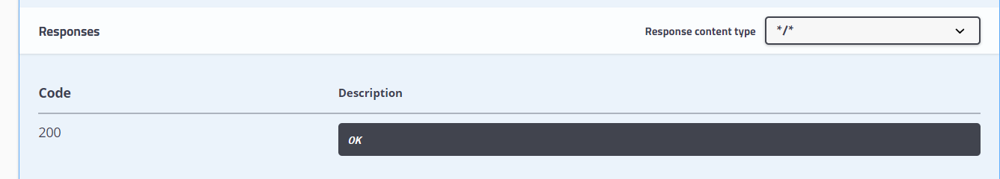

# bms-user-controller/updateAvatar

#### 接口简介

  更新头像

#### 基本信息：

- 接口状态：已完成
- 接口地址：http://localhost:8000/user/updateAvatar
- 请求方式：GET
- 请求类型：

#### 请求参数：

| 字段       | 说明     | 类型   | 备注 | 是否必填 |
| ---------- | -------- | ------ | ---- | -------- |
| avatarPath | 头像路径 | String |      | 是       |
| userName   | 用户名   | String |      | 是       |

#### 返回参数：

| 字段    | 说明       | 类型   | 备注                       |
| ------- | ---------- | ------ | -------------------------- |
| code    | 接口状态码 | Number | 成功：200  失败：-1        |
| message | 接口信息   | String | 成功：操作成功   失败： |
| data    | 返回数据   | Object | 是                         |

#### 响应实例：

